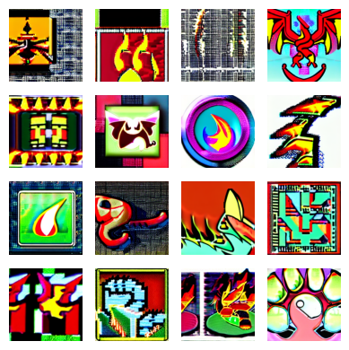
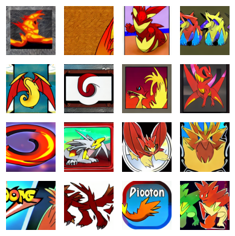
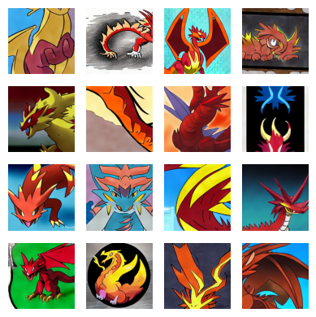
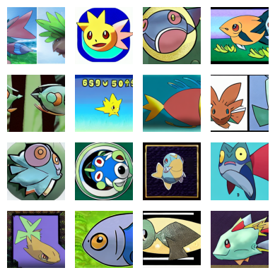
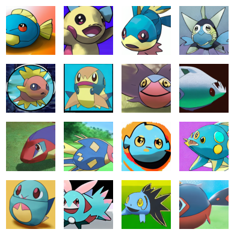
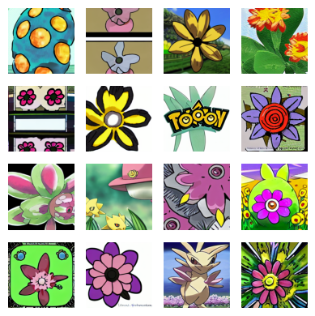
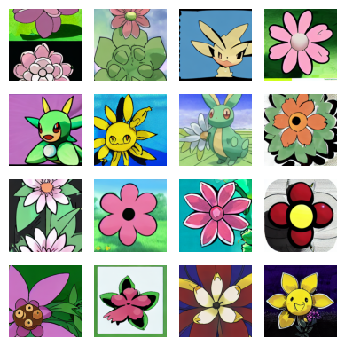

# Type-specified Pokemon Image Generation

## Overview

Course project for ECE 285 SP25 Deep Generative Models. We have fine-tuned Stable Diffusion 1.5 with a 2-stage LoRA fine-tuning strategy. In stage 1, we let model learn general Pokemon features. In stage 2, we let model learn a certain type's Pokemon features.

## Samples before and after stage 1

| Vanilla SD 1.5                               | After 4 epochs fine-tuning       | After 8 epochs fine-tuning       |
| -------------------------------------------- | -------------------------------- | -------------------------------- |
|  |  |  |

## Samples before and after stage 2

| Prompt           | Before stage 2 fine-tuning             | After 8 epochs fine-tuning             |
| ---------------- | -------------------------------------- | -------------------------------------- |
| A fish Pokemon   |      |      |
| A flower Pokemon |  |  |

## Usage

Both jupyter notebooks can run directly in Google Colab environment.

We also provide trained lora weights of stage 1 in one folder. You may directly load them. 
